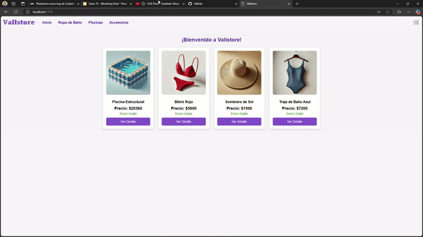

# 🏣️ Vallstore - E-commerce de Trajes de Baño 🎙

Vallstore es una aplicación de e-commerce enfocada en trajes de baño, bikinis y productos relacionados con el verano. Permite a los usuarios explorar productos, filtrar por categorías, ver detalles de cada producto, agregar productos al carrito y finalizar su compra.

---

## 🚀 Tecnologías Utilizadas

- ⚪ **React** - Framework para construir interfaces de usuario.
- ⚡ **Vite** - Para un entorno de desarrollo rápido.
- 🎨 **HTML5 y CSS3** - Estilos y estructura.
- 🛒 **React Router** - Manejo de navegación.
- 🎯 **Context API** - Gestión global del carrito de compras.

---

## 📌 Instalación y Uso

### **1⃣ Clonar el repositorio**
```bash
git clone https://github.com/JoMancini11/PreEntregaMancini.git
```

### **2⃣ Instalar dependencias**
```bash
cd PreEntregaMancini
npm install
```

### **3⃣ Iniciar el servidor de desarrollo**
```bash
npm run dev
```
📌 **Luego, abre la URL en tu navegador** (generalmente `http://localhost:5173/`).

---

## 🌟 Características del Proyecto

👉 **Navegación con React Router** (Inicio, Categorías, Detalle del Producto, Checkout).  
👉 **Lista de productos filtrada por categoría.**  
👉 **Detalle del producto con imagen, descripción y precio.**  
👉 **Selector de cantidad antes de agregar al carrito.**  
👉 **Carrito de compras con dropdown, contador de productos y total.**  
👉 **Checkout con resumen de la compra y confirmación.**  

---

## 🎥 Demostración en GIF
📌 **Mira cómo funciona la app:**



---

## 📂 Estructura del Proyecto

```
📾 vallstore
 ┣ 📂 public
 ┃ ┣ 📂 img (Imágenes de productos)
 ┃ ┣ index.html
 ┣ 📂 src
 ┃ ┣ 📂 components (Navbar, CartWidget, ItemListContainer, etc.)
 ┃ ┣ 📂 context (CartContext.jsx)
 ┃ ┣ 📂 data (productos.js)
 ┃ ┣ App.jsx
 ┃ ┣ main.jsx
 ┣ 📄 README.md
 ┣ 📄 package.json
 ┣ 📄 vite.config.js
```

---

## 🥼 Autor
👤 **José Luis Mancini**  
📧 [FacuJomanci11@gmail.com]  
📌 [https://github.com/JoMancini11]

---

